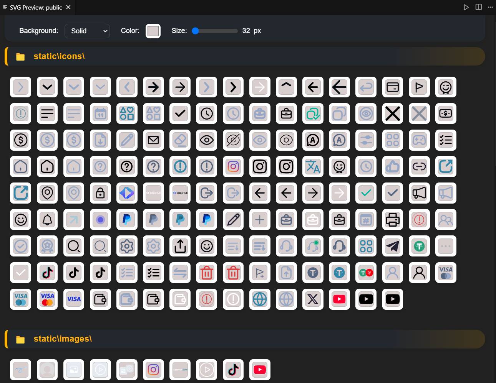
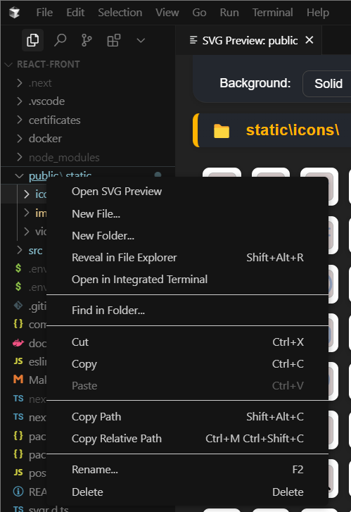

# SVG Preview Context Menu

Preview SVG files and folders with a beautiful gallery and context menu in VS Code.

 

## Features

- Right-click on any `.svg` file or folder to open a gallery preview.
- Change icon size and background in the preview panel.
- Copy SVG file path to clipboard with a click.
- Supports nested folders and groups icons visually.

## Usage

1. Right-click on a SVG file or folder in the Explorer.
2. Select **Open SVG Preview**.
3. Enjoy the gallery and use the control panel to adjust view.

## Requirements

No external dependencies. Works out of the box.

## Extension Settings

No custom settings yet.

## Known Issues

- Some SVGs with unusual markup may not display correctly.
- If you find a bug, please open an issue!

## Release Notes

### 1.0.0

- Initial release with context menu, gallery, and settings panel.

---

**Enjoy using SVG Preview Context Menu!**

